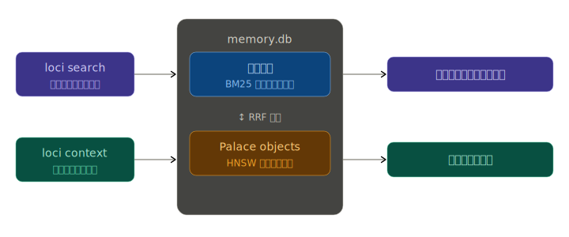

# Codeatrium

[](https://github.com/senna-lang/Codeatrium/actions/workflows/ci.yml)
[](https://pypi.org/project/codeatrium/)
[](LICENSE)

[English](README.md) · 日本語

AI コーディングエージェントに**記憶の宮殿**を。

Codeatrium は過去の会話を *palace object* に蒸留し、検索可能なインデックスに保存することで、エージェントに長期記憶を与えます。過去の意思決定・実装・コード位置を 0.2 秒で想起できます。

CLI コマンド `loci`（[Method of Loci＝記憶の宮殿](https://ja.wikipedia.org/wiki/%E5%A0%B4%E6%89%80%E6%B3%95)に由来）は**エージェント自身が呼び出す**ことを想定しています。`loci search "..." --json` をプロンプト内から実行します。

アーキテクチャは [arXiv:2603.13017](https://arxiv.org/abs/2603.13017) の会話記憶モデルを、コーディングエージェント向けに拡張したものです。

> **Note:** 現在は [Claude Code](https://docs.anthropic.com/en/docs/claude-code) 専用です。セッションログ形式（`.jsonl`）と蒸留（`claude --print`）が Claude Code に依存しています。

## シンプルなインターフェース

エージェントが使用するコマンドは基本２つ。

- **セマンティック検索** — `loci search "クエリ"` でセマンティック類似度から過去の会話を検索
- **コードから逆引き** — `loci context --symbol "名前"` で特定のコードシンボルに関する過去の会話を想起
  - tree-sitter（Python / TypeScript / Go）のシンボル解決により、エージェントは実装意図・背景を把握できる



## 仕組み



1. **Index** — エージェントのセッションログを exchange（ユーザー発話 + エージェント応答のペア）に分割し、FTS5 でキーワード検索可能にする
2. **Distill** — LLM（`claude --print`、デフォルトは `claude-haiku-4-5`）が各 exchange を palace object に要約: `exchange_core`（何をしたか）、`specific_context`（具体的な詳細）、`room_assignments`（トピックタグ）。tree-sitter で触れたファイルをシンボルレベル（関数・クラス・メソッド + ファイル + 行 + シグネチャ）に解決
3. **Search** — 会話原文の BM25 と蒸留済み埋め込みの HNSW を RRF で融合するクロスレイヤー検索

会話原文は埋め込まず、蒸留で濃縮されたテキストのみを `multilingual-e5-small`（384次元）で埋め込むことで、セマンティック検索の精度と埋め込みコストを両立しています。埋め込みモデルは **Unix ソケットサーバー**で常駐し、初回以降の検索は **0.2 秒以内**で返ります。

## インストール

```bash
pipx install codeatrium
```

Python 3.11 以上が必要です。

## クイックスタート

```bash
# プロジェクトルートで初期化
loci init

# 自動インデックスのフックをインストール
loci hook install
```

`loci init` を実行すると、過去のセッションログが検出された場合に以下の質問が表示されます:

> [!IMPORTANT]
> 途中からこのツールを導入する場合、すでに大量の exchange が蓄積されています。全件蒸留すると `claude --print` (Haiku) のトークンが大量に消費されるため、まずは `Skip all` か `Distill last 50` で始めることを推奨します。

1. **Min chars threshold** — exchange の最小文字数フィルタ（デフォルト: 50文字）。この閾値で蒸留の母数（対象 exchange 数）が決まります。値を大きくすると短い会話が除外され蒸留対象が減り、小さくするとほぼ全ての会話が蒸留対象になりトークン消費が増えます。
2. **既存 exchange の扱い** — 過去のセッションをどこまで蒸留するか選択:
   - Skip all（過去のセッション蒸留なし）
   - Distill last 50（直近の履歴のみ）
   - Distill all（全件、トークン消費あり）
   - Custom（件数を指定）
3. **蒸留を今すぐ実行するか** — No を選ぶと次回セッション開始時に自動実行されます

## エージェント向けインストラクション

エージェントへのインストラクションは自動挿入されるので手動で書く必要はありません:

- **`loci init`** — `CLAUDE.md` にマーカー付きセクション（`<!-- BEGIN CODEATRIUM -->...<!-- END CODEATRIUM -->`）を挿入。
- **`loci prime`** — SessionStart Hook で毎セッション開始時にコマンドの使い方をコンテキストウィンドウに動的注入

## CLI コマンド

| コマンド | 説明 |
|---------|------|
| `loci init` | プロジェクトルートに `.codeatrium/` を初期化 |
| `loci index` | 新しいセッションログをインデックス |
| `loci distill [--limit N]` | 未蒸留の exchange を LLM で蒸留 |
| `loci search "クエリ" --json` | セマンティック検索（エージェント向け） |
| `loci context --symbol "名前" --json` | コードシンボル → 過去の会話 |
| `loci show "<ref>" --json` | 会話原文を取得 |
| `loci status` | インデックス状態を表示 |
| `loci server start/stop/status` | 埋め込みサーバー管理 |
| `loci hook install` | Claude Code の設定にフックを登録 |

## 自動化（Claude Code フック）

`loci hook install` 後、すべて自動で動作します:

| フック | トリガー | コマンド |
|--------|---------|---------|
| Stop (async) | 毎ラリー後 | `loci index` |
| SessionStart | 起動時 / `/clear` / `/resume` / `compact` | `loci prime` |
| SessionStart | 起動時 / `/clear` / `/resume` / `compact` | `loci server start` |
| SessionStart | 起動時 / `/clear` / `/resume` / `compact` | `loci distill` |

- **`loci index`** — 毎ラリー後に非同期で実行。セッション途中でも差分のみインデックスするので高速
- **`loci distill`** — セッション開始時に未蒸留の exchange を `claude --print` で蒸留。ユーザーの Claude Code で Haiku を呼び出します（デフォルト: `claude-haiku-4-5`）
- **`loci server start`** — 埋め込みモデル（約500MB）をメモリに常駐させ、以降の検索を 0.2 秒以内に

## 検索出力

```json
[
  {
    "exchange_core": "pool_size=5 でコネクションプールを追加した",
    "specific_context": "pool_size=5, max_overflow=10",
    "rooms": [
      { "room_type": "concept", "room_key": "db-pool", "room_label": "DB コネクションプーリング" }
    ],
    "symbols": [
      { "name": "create_pool", "file": "src/db.py", "line": 42, "signature": "def create_pool(...)" }
    ],
    "verbatim_ref": "~/.claude/projects/.../session.jsonl:ply=42"
  }
]
```

## 設定

`.codeatrium/config.toml`（`loci init` で生成）:

```toml
[distill]
model = "claude-haiku-4-5-20251001"   # 蒸留に使うモデル（デフォルト）
batch_limit = 20                       # 1回あたりの蒸留上限

[index]
min_chars = 50                         # この文字数未満の exchange をスキップ
```

## Acknowledgments

Palace object モデル、room ベースのトピックグルーピング、BM25+HNSW 融合検索は以下の論文に基づいています:

> *Structured Distillation for Personalized Agent Memory*
> (arXiv:2603.13017)


## ライセンス

MIT
