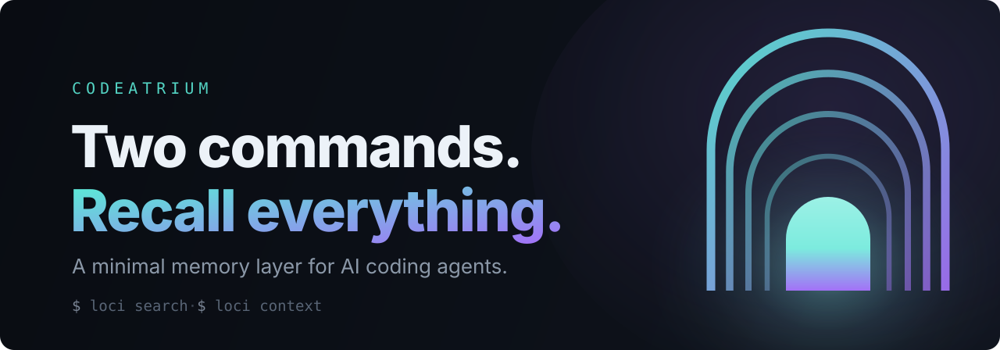
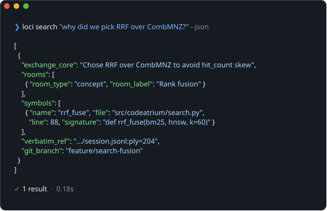
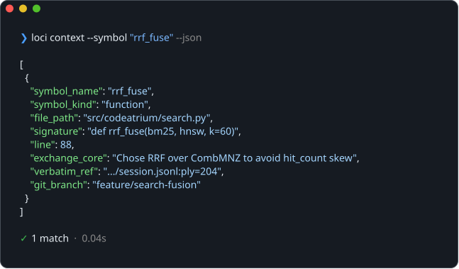
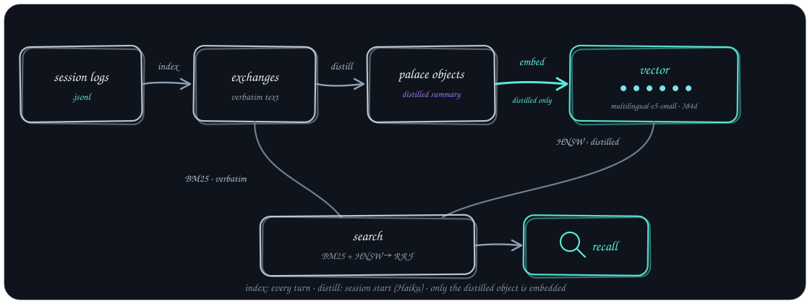

<p align="center">
  
</p>

<p align="center">
  <a href="https://github.com/senna-lang/Codeatrium/actions/workflows/ci.yml"></a>
  <a href="https://pypi.org/project/codeatrium/"></a>
  <a href="LICENSE"></a>
</p>

<p align="center"><a href="README.md">English</a> · 日本語</p>

<p align="center">
  
</p>

AI コーディングエージェントは、自分がやってきたことを 2 つのコマンド — `loci search` と `loci context` — だけで思い出せます。インターフェースはこれだけ。エージェントは迷うことなく適切な呼び出しを選び、過去の意思決定・会話・正確なコード位置を 0.2 秒以内に復元します。

CLI コマンド `loci` は**エージェント自身が呼び出す**ことを想定しています — `loci search "..." --json` をプロンプト内から実行します。*(名前は記憶術 [Method of Loci＝記憶の宮殿](https://ja.wikipedia.org/wiki/%E5%A0%B4%E6%89%80%E6%B3%95) に由来します。内部では会話を「palace object」に蒸留します（[仕組み](#仕組み)を参照）。アーキテクチャは [arXiv:2603.13017](https://arxiv.org/abs/2603.13017) の会話記憶モデルをコーディングエージェント向けに拡張したものです。)*

> **Note:** 現在は [Claude Code](https://docs.anthropic.com/en/docs/claude-code) 専用です — インデックスは Claude Code のセッションログ（`.jsonl`）を読み込みます。蒸留は既定で `claude --print`（Haiku）ですが、ローカルの OpenAI 互換 LLM でも実行できます（[設定](#設定)を参照）。

## ミニマルなインターフェース

想起のインターフェースは 2 つのコマンドだけ:

- **`loci search "クエリ"`** — 過去の会話をセマンティック検索
- **`loci context`** — 逆引き。コードシンボル（`--symbol "名前"`）または git ブランチ（`--branch "名前"`）から
  - tree-sitter のシンボル解決（Python / TypeScript / Go）により、エージェントは編集前に実装意図を把握できる
  - `--branch "名前"` は特定の git ブランチで何をしたか・議論したかを想起（`loci search "クエリ" --branch "名前"` でも可）

これは意図的な設計です。ここでの利用者はエージェント自身であり、50 個のツールを渡されたエージェントは迷い、選び間違え、どれを呼ぶか決めるだけでトークンを消費します。表面がこれだけ小さく — かつ MCP のツール定義がコンテキストウィンドウに常駐しない — ので、エージェントは毎回・最初から正しい呼び出しに手を伸ばします。*(会話原文が必要なときは `loci show "<ref>"` で任意の結果を原文に展開できます。)*

シンボルに触れることは、それについて決めたことを想起すること — `loci context` は正確なコード位置・シグネチャと、その背後にある会話を逆引きします:

<p align="center">
  
</p>

## 仕組み

<p align="center">
  
</p>

1. **Index** — エージェントのセッションログを exchange（ユーザー発話 + エージェント応答のペア）に分割し、FTS5 でキーワード検索可能にする
2. **Distill** — LLM（`claude --print`、デフォルトは `claude-haiku-4-5`）が各 exchange を palace object に要約: `exchange_core`（何をしたか）、`specific_context`（具体的な詳細）、`room_assignments`（トピックタグ）。tree-sitter で触れたファイルをシンボルレベル（関数・クラス・メソッド + ファイル + 行 + シグネチャ）に解決
3. **Search** — 会話原文の BM25 と蒸留済み埋め込みの HNSW を RRF で融合するクロスレイヤー検索

会話原文は埋め込まず、蒸留で濃縮されたテキストのみを `multilingual-e5-small`（384次元）で埋め込むことで、セマンティック検索の精度と埋め込みコストを両立しています。埋め込みモデルは **Unix ソケットサーバー**で常駐し、初回以降の検索は **0.2 秒以内**で返ります。

## インストール

```bash
pipx install codeatrium
```

Python 3.11 以上が必要です。

## クイックスタート

```bash
# プロジェクトルートで初期化（Claude Code フックも自動登録）
loci init
```

`loci init` は DB 初期化・既存セッション検出・Claude Code フック登録をすべて一度に済ませます。`--no-hooks` を付けるとフック登録をスキップします。途中で失敗した場合は `.codeatrium/` が自動で掃除されるので、再実行して問題ありません。

`loci init` を実行すると、過去のセッションログが検出された場合に以下の質問が表示されます:

> [!IMPORTANT]
> 途中からこのツールを導入する場合、すでに大量の exchange が蓄積されています。全件蒸留すると `claude --print` (Haiku) のトークンが大量に消費されるため、まずは `Skip all` か `Distill last 50` で始めることを推奨します。

1. **Min chars threshold** — インデックス時に適用される最小文字数フィルタ（デフォルト: 50文字）。短い exchange はそもそもインデックスされず、その結果として蒸留の母数も減ります。値を大きくすると短い会話が除外され、小さくするとほぼ全ての会話が対象になりトークン消費が増えます。（蒸留には別途 `min_chars=100` のフィルタがあります — [設定](#設定)を参照。）
2. **既存 exchange の扱い** — 過去のセッションをどこまで蒸留するか選択:
   - Skip all（過去のセッション蒸留なし）
   - Distill last 50（直近の履歴のみ）
   - Distill all（全件、トークン消費あり）
   - Custom（件数を指定）
3. **蒸留を今すぐ実行するか** — `1`/`2`/`y`/`n`/`yes`/`no` を受理。No を選ぶと次回セッション開始時に自動実行されます。

各プロンプトで無効な入力をした場合、サイレントにデフォルトへ倒れず再入力を求めます。

## エージェント向けインストラクション

エージェントへのインストラクションは自動挿入されるので手動で書く必要はありません:

- **`loci init`** — `CLAUDE.md` にマーカー付きセクション（`<!-- BEGIN CODEATRIUM -->...<!-- END CODEATRIUM -->`）を挿入。
- **`loci prime`** — SessionStart Hook で毎セッション開始時にコマンドの使い方をコンテキストウィンドウに動的注入

## CLI コマンド

| コマンド | 説明 |
|---------|------|
| `loci init` | `.codeatrium/` を初期化し Claude Code フックを登録（`--no-hooks` で省略可） |
| `loci index` | 新しいセッションログをインデックス |
| `loci distill [--limit N]` | 未蒸留の exchange を LLM で蒸留 |
| `loci search "クエリ" --json` | セマンティック検索（エージェント向け）。`--branch NAME` で git ブランチ絞り込み |
| `loci context --symbol "名前" --json` | コードシンボル → 過去の会話（軽量。`--full` で会話原文も含める） |
| `loci context --branch "名前" --json` | git ブランチ → 過去の会話（未蒸留の exchange も含む） |
| `loci show "<ref>" --json` | 会話原文を取得 |
| `loci status` | インデックス状態を表示 |
| `loci prime` | コマンドの使い方をセッションコンテキストに注入（SessionStart フックで自動実行） |
| `loci server start/stop/status` | 埋め込みサーバー管理 |
| `loci hook install` | フックを再登録（通常は `loci init` で済む） |
| `loci hook uninstall` | codeatrium のフックを `settings.json` から削除 |

## 自動化（Claude Code フック）

`loci init`（または `loci hook install`）後、すべて自動で動作します:

| フック | トリガー | コマンド |
|--------|---------|---------|
| Stop (async) | 毎ラリー後 | `loci index` |
| SessionStart | 起動時 / `/clear` / `/resume` / `compact` | `loci prime` |
| SessionStart | 起動時 / `/clear` / `/resume` / `compact` | `loci server start` |
| SessionStart | 起動時 / `/clear` / `/resume` / `compact` | `loci distill` |

- **`loci index`** — 毎ラリー後に非同期で実行。セッション途中でも差分のみインデックスするので高速
- **`loci distill`** — セッション開始時に未蒸留の exchange を蒸留。既定は `claude --print`（Haiku、ユーザーの Claude Code 経由）ですが、ローカルの OpenAI 互換 LLM でも実行できます（[設定](#設定)を参照）
- **`loci server start`** — 埋め込みモデル（約500MB）をメモリに常駐させ、以降の検索を 0.2 秒以内に

## 検索出力

```json
[
  {
    "exchange_core": "pool_size=5 でコネクションプールを追加した",
    "specific_context": "pool_size=5, max_overflow=10",
    "rooms": [
      { "room_type": "concept", "room_key": "db-pool", "room_label": "DB コネクションプーリング" }
    ],
    "symbols": [
      { "name": "create_pool", "file": "src/db.py", "line": 42, "signature": "def create_pool(...)" }
    ],
    "verbatim_ref": "~/.claude/projects/.../session.jsonl:ply=42",
    "git_branch": "feature/db-pool"
  }
]
```

## 設定

`.codeatrium/config.toml`（`loci init` で生成）:

```toml
[distill]
provider = "claude"                    # 蒸留 backend: "claude" | "openai"（既定 "claude"）
model = "claude-haiku-4-5"             # 蒸留に使うモデル（デフォルト）
batch_limit = 20                       # 1回あたりの蒸留上限
min_chars = 100                        # この文字数未満の exchange は蒸留をスキップ

[index]
min_chars = 50                         # この文字数未満の exchange はインデックスをスキップ
```

`min_chars` は2か所あります。`[index] min_chars` はそもそもインデックス対象にするかを制御し、`[distill] min_chars` はインデックス済みの短い exchange について蒸留（LLM コスト）をさらにスキップします。

### ローカル LLM で蒸留する

蒸留は exchange ごとの小さな構造化抽出タスクなので、ローカルモデルでも十分なことが多いです。OpenAI 互換のエンドポイント（Ollama、LM Studio、llama.cpp-server、vLLM）なら `provider = "openai"` と `base_url` を指定するだけで動きます — 新規依存なし・API キー不要（`Authorization` ヘッダーは送らないため、ローカル専用です）:

```toml
[distill]
provider = "openai"
model = "qwen2.5:7b"
base_url = "http://localhost:11434/v1"   # Ollama
# base_url = "http://localhost:1234/v1"  # LM Studio
```

`provider = "openai"` のとき `base_url` は必須です。未設定または空の場合は警告して `claude` にフォールバックします。`provider = "claude"`（既定）では `base_url` は無視され、従来どおり `claude --print` で蒸留します。

## Acknowledgments

Palace object モデル、room ベースのトピックグルーピング、BM25+HNSW 融合検索は以下の論文に基づいています:

> *Structured Distillation for Personalized Agent Memory*
> (arXiv:2603.13017)


## ライセンス

MIT
