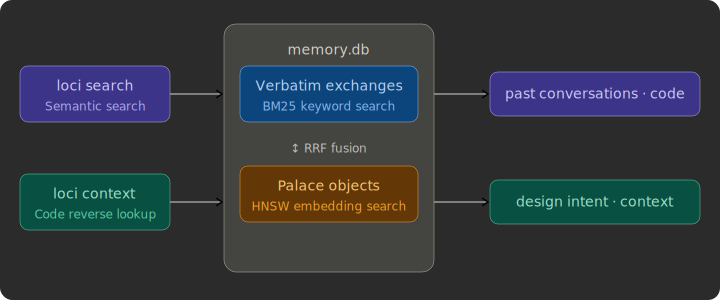

# Codeatrium

[](https://github.com/senna-lang/Codeatrium/actions/workflows/ci.yml)
[](https://pypi.org/project/codeatrium/)
[](LICENSE)

A **memory palace** for AI coding agents.

English · [日本語](README.ja.md)

Codeatrium distills past conversations into *palace objects* and stores them in a searchable index, giving agents long-term memory. Past decisions, implementations, and code locations can be recalled in under 0.2 seconds.

The CLI command `loci` (from [Method of Loci](https://en.wikipedia.org/wiki/Method_of_loci)) is designed to be **called by the agent itself** — running `loci search "..." --json` from within a prompt.

The architecture extends the conversational memory model from [arXiv:2603.13017](https://arxiv.org/abs/2603.13017) for coding agents.

> **Note:** Currently [Claude Code](https://docs.anthropic.com/en/docs/claude-code) only. Session log format (`.jsonl`) and distillation (`claude --print`) depend on Claude Code.

## Simple Interface

Agents use two core commands:

- **Semantic search** — `loci search "query"` retrieves past conversations by semantic similarity
- **Reverse lookup from code** — `loci context --symbol "name"` recalls past conversations about a specific code symbol
  - tree-sitter symbol resolution (Python / TypeScript / Go) lets agents understand implementation intent before editing



## How It Works


1. **Index** — Splits agent session logs into exchanges (user utterance + agent response pairs) and indexes them with FTS5 for keyword search
2. **Distill** — An LLM (`claude --print`, default `claude-haiku-4-5`) summarizes each exchange into a palace object: `exchange_core` (what was done), `specific_context` (concrete details), `room_assignments` (topic tags). tree-sitter resolves touched files to symbol level (function/class/method + file + line + signature)
3. **Search** — Cross-layer search fusing BM25 on verbatim text with HNSW on distilled embeddings via RRF

Raw conversations are not embedded — only the condensed distilled text is embedded with `multilingual-e5-small` (384-dim), balancing semantic search quality with embedding cost. The embedding model runs as a **Unix socket server**, keeping search latency **under 0.2 seconds** after the first load.

## Installation

```bash
pipx install codeatrium
```

Requires Python 3.11+.

## Quick Start

```bash
# Initialize in project root
loci init

# Install hooks for automatic indexing
loci hook install
```

When running `loci init`, if past session logs are detected, you'll be prompted with:

> [!IMPORTANT]
> When adopting this tool mid-project, a large number of exchanges may already exist. Distilling all of them will consume significant `claude --print` (Haiku) tokens. We recommend starting with `Skip all` or `Distill last 50`.

1. **Min chars threshold** — Minimum character filter for exchanges (default: 50). This controls how many exchanges become distillation candidates. Higher values exclude short conversations and reduce token usage; lower values include nearly everything.
2. **Handling existing exchanges** — Choose how much past history to distill:
   - Skip all (no past session distillation)
   - Distill last 50 (recent history only)
   - Distill all (everything — high token cost)
   - Custom (specify a number)
3. **Run distillation now?** — Choose No to defer to the next session start

## Agent Instructions

Agent instructions are injected automatically — no manual setup required:

- **`loci init`** — Inserts a marker section (`<!-- BEGIN CODEATRIUM -->...<!-- END CODEATRIUM -->`) into `CLAUDE.md`
- **`loci prime`** — Dynamically injects command usage into the context window at every session start via SessionStart Hook

## CLI Commands

| Command | Description |
|---------|-------------|
| `loci init` | Initialize `.codeatrium/` in project root |
| `loci index` | Index new session logs |
| `loci distill [--limit N]` | Distill undistilled exchanges via LLM |
| `loci search "query" --json` | Semantic search (agent-facing) |
| `loci context --symbol "name" --json` | Code symbol → past conversations |
| `loci show "<ref>" --json` | Retrieve verbatim conversation |
| `loci status` | Show index state |
| `loci server start/stop/status` | Embedding server management |
| `loci hook install` | Register hooks in Claude Code settings |

## Automation (Claude Code Hooks)

After `loci hook install`, everything runs automatically:

| Hook | Trigger | Command |
|------|---------|---------|
| Stop (async) | After every turn | `loci index` |
| SessionStart | startup / `/clear` / `/resume` / `compact` | `loci prime` |
| SessionStart | startup / `/clear` / `/resume` / `compact` | `loci server start` |
| SessionStart | startup / `/clear` / `/resume` / `compact` | `loci distill` |

- **`loci index`** — Runs asynchronously after every turn. Indexes only new exchanges, so it's fast even mid-session
- **`loci distill`** — Distills undistilled exchanges at session start via `claude --print`. Calls Haiku through the user's Claude Code (default: `claude-haiku-4-5`)
- **`loci server start`** — Keeps the embedding model (~500MB) resident in memory for sub-0.2s search latency

## Search Output

```json
[
  {
    "exchange_core": "Added connection pool with pool_size=5",
    "specific_context": "pool_size=5, max_overflow=10",
    "rooms": [
      { "room_type": "concept", "room_key": "db-pool", "room_label": "DB connection pooling" }
    ],
    "symbols": [
      { "name": "create_pool", "file": "src/db.py", "line": 42, "signature": "def create_pool(...)" }
    ],
    "verbatim_ref": "~/.claude/projects/.../session.jsonl:ply=42"
  }
]
```

## Configuration

`.codeatrium/config.toml` (generated by `loci init`):

```toml
[distill]
model = "claude-haiku-4-5-20251001"   # Model for distillation (default)
batch_limit = 20                       # Max distillations per hook run

[index]
min_chars = 50                         # Skip exchanges shorter than this
```

## Acknowledgments

The palace object model, room-based topic grouping, and BM25+HNSW fusion search are based on:

> *Structured Distillation for Personalized Agent Memory*
> (arXiv:2603.13017)


## License

MIT
